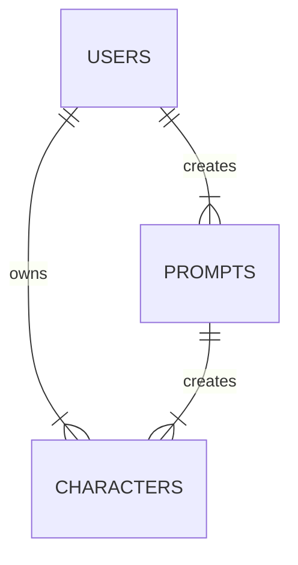
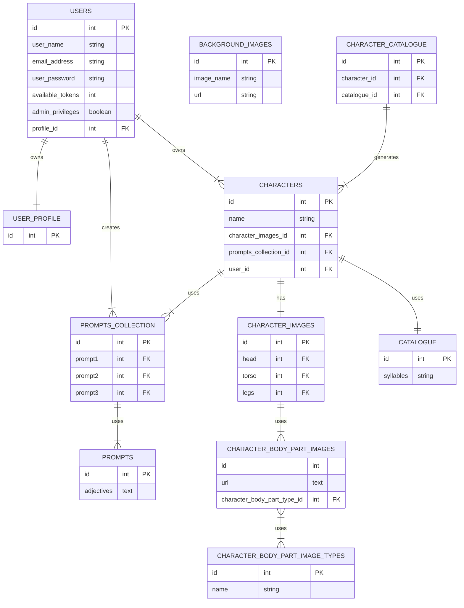

# Create An Orc project

This website provides a randomised name, stats, an description built from a prompt and a visual
picture of your character made from randomised pieces of pixel character art. This fantasy character will be an `orc` 
which will be communicated in the branding of the site.
The generation of a short description of the character will be done through prompts to OpenAI.
The randomised character will be regenerated on a page refresh. This is to quickly give a user 
seeking an idea for art or writing a compelling starting off point.

## Problem Definition
Creating a new character for a series or for a TTRPG can sometimes be a daunting process if people are
experiencing a creative block. 
This project intends to provide a compelling starting off point to encourage user ideas and creativity.
The design will focus on accessibility and speed to get creatives thinking with minimal effort, but will be
able to eventually include some more incentives for repeat users like saving and sharing their 
favourite random prompts.

## Who is it for?
This project is designed to provide a creative prompt for writers/artists/ttrpg players or anyone seeking a
prompt to form an idea for a fantasy character.

## MOSCOW analysis

### Must have
- A pixel art image of the randomised character. This has been created through:
  - A shadow base 
  - A face with skin colour 
  - Upper torso clothes 
  - Lower torso clothes 
- These individual images are layered together on the screen and will appear in the same place on page refresh
- A randomised name which has been built out of syllables provided in a JSON file.
- A randomised description created via prompts to Open AI. The prompts should have randomised values each time it is sent
through to the AI. The AI generates the description which will be sent back and displayed.
- Randomised Stats for the character
### Should have
- User accounts where a user can save instances of characters that they wish to keep record of. 
- Rate limiting to prevent an overload of AI requests. 
- The website should be viewable and usable on different screen sizes. 
### Could have
- Eventually expand to other kinds of fantasy characters, like elves, dwarves etc. Each new type of potential character
will need to be added as separate updates. 
- Users can share their favourite creations with other users. 
### Won't have
- A full gameified character sheet for ttrpg players as this would be too complex. 
- A massively expanded description of the character as this is just meant to be a simple prompt to inspire user
creativity. 

## Domain Model Diagram


## Dictionary
- **User**: Any person accessing the website and viewing a randomised character
- **Character**: The generated characters that are returned via the randomiser code and the AI. Initially this is just for Orcs as a race.
- **Prompt**: Randomised adjectives that will be provided in threes to the AI to generate a
character. For example an orc character may be:
  - Adventurous
  - Poor
  - Good
- **Catalogue**: Syllables stored within the databases used for the purpose of character name generation and suplementing prompts with Retrieval Augemented Generation (RAG).

---

## Entity Relationship Diagram


# APIs


## Users/


## Users GET requests

## GET /users

Description: Get all users.

Response codes:

200 OK\
404 Not Found

Response Example
```
[
  {
    "id": 1,
    "user_name": "testadmin",
    "email_address": "adminaccount@example.com",
    "admin_privileges": 1,
    "profile_id": 1
  },
  {
    "id": 2,
    "user_name": "testuser",
    "email_address": "testaccount@example.com",
    "admin_privileges": 0,
    "profile_id": 2
  }
]
```

### GET /users/{id}

Description: Get a single user by ID

Response codes:

200 OK\
404 Not Found

Response Example
```
  {
    "id": 1,
    "user_name": "testadmin",
    "email_address": "adminaccount@example.com",
    "admin_privileges": 1,
    "profile_id": 1
  }
```
### GET /users/{profile_id}

Description: Get a single users profile by ID.

Response codes:

200 OK\
404 Not Found

Response Example
```
{
    "id": 2,
    "user_name": "testuser",
    "email_address": "testaccount@example.com",
    "admin_privileges": 0,
    "profile_id": 2
}
```

---
## Users POST requests

### POST /users

Description: Register an account for a new user.

Request Example:
```
{
  "user_name": "newUser",
  "email_address": "new_user@example.com,
  "user_password": "encryptedPassword",
  "admin_privileges": 0
}
```

Response codes:

200 OK\
201 Created\
400 Bad Request

Response Example:
```
{
  "id": 3,
  "user_name": "newUser",
  "email_address": "new_user@example.com",
  "admin_privileges": 0,
  "profile_id": 3
}
```

---
## Users PUT requests

### PUT users/{id}

Description: Update a single user account.

Request Example:
```
{
  "user_name": "new_user",
  "email_address": "updated_email@example.com",
  "user_password": "newEncryptedPassword",
  "admin_privileges": 0
}
```

Response codes:

200 OK\
201 Created\
400 Bad Request

```
Response Example:

{
  "id": 3,
  "user_name": "updated_new_user",
  "email_address": "updated_email@example.com",
  "admin_privileges": 0,
  "profile_id" : 3
}
```

---
## Users DELETE requests

### DELETE users/{id}

Description: Delete a single user account.

Request Example:
```
{
  "user_name": "deletedUser",
  "email_address": "deleted_user@example.com,
  "user_password": "encryptedPassword",
  "admin_privileges": 0
}
```

Response codes:

204 Resource deleted successfully\
404 Not found

---

## Characters

## Characters GET requests

### GET /users/{id}/characters

Description: Get all characters saved to a user.

Response codes:

200 OK\
404 Not Found

Response Example
```
[
  {
    "id": 1,
    "name": "testOrc1",
    "prompts_collection_id": 1,
    "character_images_id": 1,
    "user_id": 1
  },
  {
    "id": 2,
    "name": "testOrc2",
    "prompts_collection_id": 2,
    "character_images_id": 2,
    "user_id": 1
  }
]
```

### GET /users/{id}/characters/{id}

Description: Get a single character by ID saved by a user.

Response codes:

200 OK\
404 Not Found

Response Example
```
  {
    "id": 1,
    "name": "testOrc1",
    "prompts_collection_id": 1,
    "character_images_id": 1,
    "user_id": 1
  }
```

---
## Characters POST requests

### POST /users/{id}/characters{id}

Description: Saves a new character for a user.

Request Example:
```
  {
    "name": "testOrc3",
    "prompts_collection_id": 3,
    "character_images_id": 3,
    "user_id": 3
  },
```

Response codes:

200 OK\
201 Created\
400 Bad Request

Response Example:
```
{
  "id": 3,
  "name": "testOrc3",
  "prompts_collection_id": 3,
  "character_images_id": 3,
  "user_id": 3
}
```

---

## Characters PUT requests

Once new objects are posted into the Characters database they shouldn't be updated or changed.

---

## Characters DELETE requests

### DELETE users/{id}/characters/{id}

Description: Delete a saved character from a user collection.

Request Example:
```
{
  "id": 1,
  "name": "testOrc1",
  "prompts_collection_id": 1,
  "character_images_id": 1,
  "user_id": 1
}
```

Response codes:

204 Resource deleted successfully\
404 Not found

---

## Prompts GET requests

## GET /prompts

Description: Get all prompts.

Response codes:

200 OK\
404 Not Found

Response Example
```
[
  {
    "id": 1,
    "adjectives: "good"
  },
  {
    "id": 2,
    "adjectives" : "evil"
  }
]
```

## GET /prompts/{id}

Description: Get a single prompt by id.

Response codes:

200 OK\
404 Not Found

Response Example
```
  {
    "id": 3,
    "adjectives: "neutral"
  }
```
---
## Prompts POST requests

### POST /prompts

Description: Submit a new prompt to the database.

Request Example:
```
{
  "adjectives" : "happy"
}
```

OR

```
[
  {
    "adjectives": "sad"
  },
  {
    "adjectives": "angry"
  }
]
```

Response codes:

200 OK\
201 Created\
400 Bad Request

---
## Prompts PUT requests

### PUT prompts/{id}

Description: Update a prompt by id.

Request Example:
```
{
  "id": 5,
  "adjectives": "prompt_to_update"
}
```

Response codes:

200 OK\
201 Created\
400 Bad Request

```
Response Example:

{
  "id": 5",
  "adjectives" : "prompt_to_update"
}
```

---
## Prompts DELETE requests

### DELETE prompts/{id}

Description: Delete a single prompt by id.

Request Example:
```
{
  "id": "6",
  "adjectives" : "delete_this_prompt"
}
```

Response codes:

204 Resource deleted successfully\
404 Not found

---
